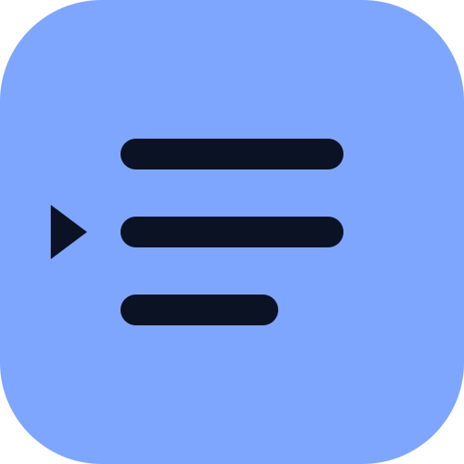
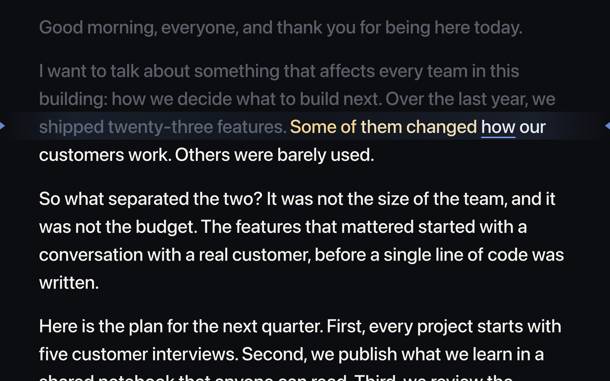
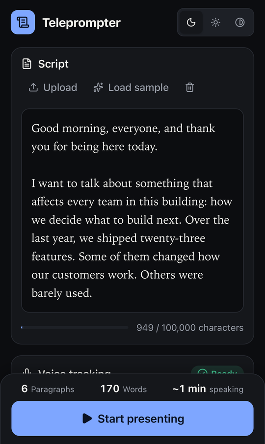
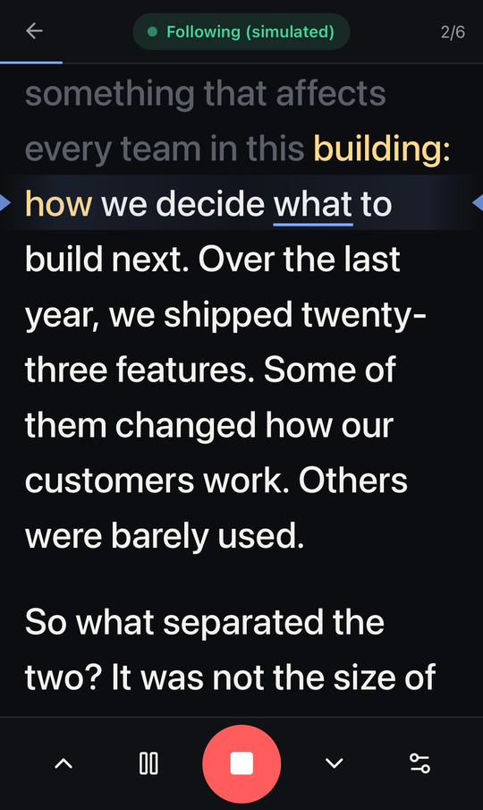
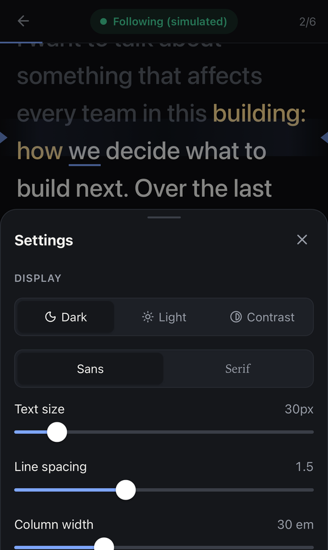
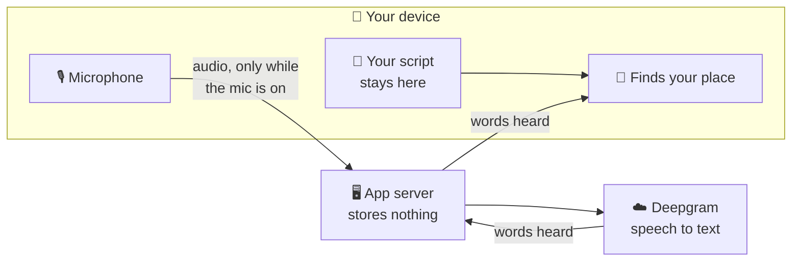
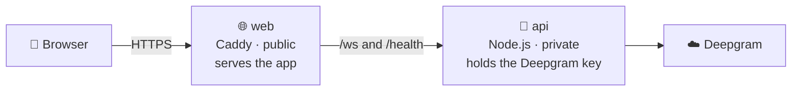
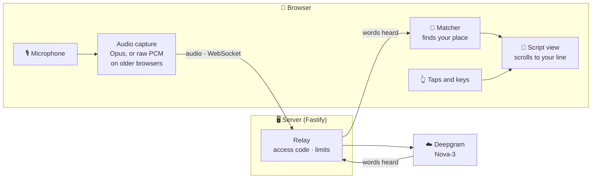
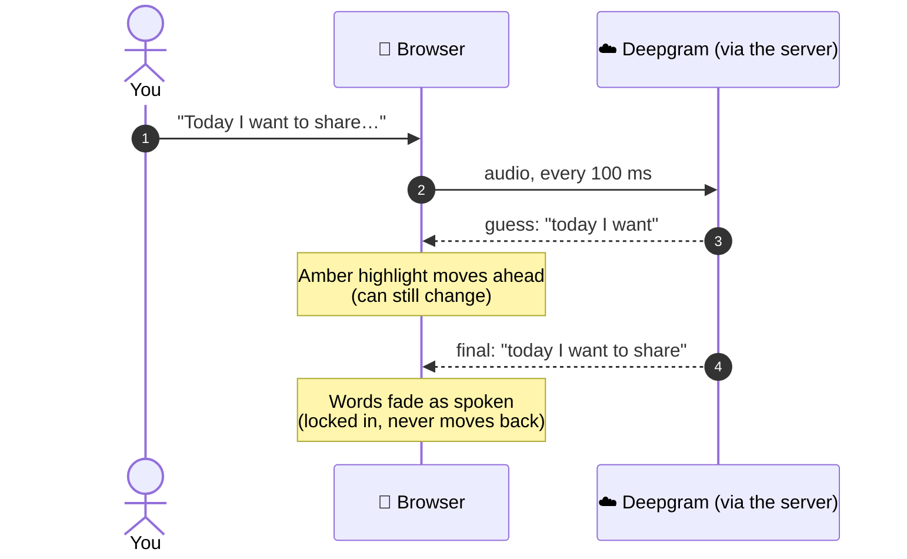
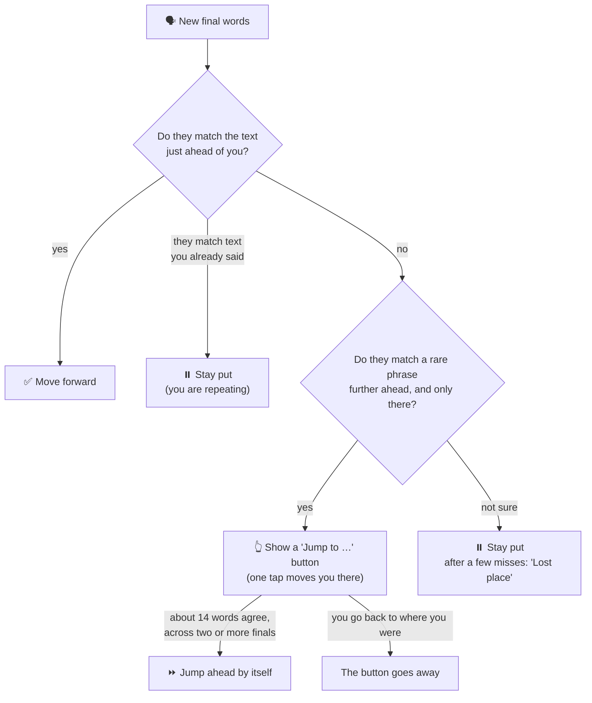

<div align="center">



# Teleprompter

**A script that follows your voice, so you never lose your place.**

Paste your talk, tap the microphone and speak. The script moves with you. The line you are on
stays at eye level, and the words you have already said fade out.

<br />



<sub>The presenter view in the middle of a talk (recorded with the built-in practice mode).</sub>

<br />
<br />

[](https://github.com/rimorin/tk_teleprompter/actions/workflows/ci.yml)


[](LICENSE)

[Why](#-why-this-exists) · [How it works](#-how-it-works) · [Features](#-features) ·
[Privacy](#-privacy) · [Quick start](#-quick-start) · [Deploy](#-deploying) ·
[Under the hood](#-under-the-hood)

</div>

---

## 💡 Why this exists

Speakers use notes to stay on track. But notes on a phone or tablet cause two problems:

- **You have to scroll.** Each swipe pulls your attention away from your audience.
- **You have to look up.** When you look back down, you see a wall of text and must find your
  place again.

It is easy to lose your place on the page, and your train of thought with it.

**Teleprompter fixes both.** It listens while you speak, works out where you are in the script,
and keeps that line in view for you. Look up. Make eye contact. Pause. Tell a story that is not in
your notes. When you look back down, your place is waiting.

## 🎬 How it works

<table>
<tr>
<td width="33%" valign="top">

### 1 · Add your script

Paste it, or upload a `.txt` or `.docx` file. Your paragraphs stay exactly as you wrote them.

</td>
<td width="33%" valign="top">

### 2 · Start presenting

Choose a text size and theme you like. Tap the microphone.

</td>
<td width="33%" valign="top">

### 3 · Just talk

The script follows you. Tap any word to jump there yourself.

</td>
</tr>
</table>

### Reading the screen

| You see         | It means                               |
| --------------- | -------------------------------------- |
| Faded text      | You have said this                     |
| Warm amber text | What the app is hearing right now      |
| Underlined word | Your next word                         |
| ◀ ▶ markers     | The reading line. Your line stays here |

### Made for talks that don't go to plan

Nobody reads a talk word for word. The app is built for that.

| When you…                         | The app…                                                              |
| --------------------------------- | --------------------------------------------------------------------- |
| **Pause** to breathe or think     | waits. Nothing moves while you are silent.                            |
| **Go off script** to tell a story | keeps your place, then picks up when you come back to the script.     |
| **Say it differently** or stumble | copes with misheard words, "um" and "so", and small wording changes.  |
| **Skip** a sentence or a section  | offers a **Jump to …** button at once, and jumps by itself when sure. |
| **Repeat** a line for effect      | never jumps backward by itself.                                       |
| **Lose the network**              | reconnects by itself and carries on. The buttons always still work.   |
| **Lose the mic**                  | stops where you are and tells you.                                    |

> [!NOTE]
> A common phrase like "thank you very much" can appear in many places. On its own, it is never
> enough to make the script jump.

## ✨ Features

<table>
<tr>
<td width="50%" valign="top">

**🎤 Made for the stage**

- Large text. Change the size, line spacing, column width and font.
- Dark and light themes.
- Mirrored text for teleprompter glass.
- Move the reading line. By default it sits near the top, close to your camera.
- Smooth scrolling that ignores tiny moves and respects "reduce motion".

</td>
<td width="50%" valign="top">

**🙌 Hands-free, with manual control**

- Follows your voice, with a clear status: _Listening_, _Lost place_, _Paused_.
- Tap any word or paragraph to jump there.
- Previous and next paragraph buttons.
- Keyboard shortcuts, and support for presenter clickers (Page Up / Page Down).

</td>
</tr>
<tr>
<td width="50%" valign="top">

**📱 Phone and tablet first**

- Big buttons within thumb reach.
- Keeps the screen on while you present.
- Works in portrait and landscape.
- Add it to your home screen like an app.
- Light on mobile data: it sends compressed audio (about 32 kbit/s) where the browser supports it.

</td>
<td width="50%" valign="top">

**🧪 Practise any time**

- A built-in practice mode acts like a speaker (clean, noisy, or with skips and stories). No
  microphone or API key needed.
- Manual mode works fully offline.

</td>
</tr>
</table>

<table>
<tr>
<td align="center"><br /><sub>Add your script</sub></td>
<td align="center"><br /><sub>Present hands-free</sub></td>
<td align="center"><br /><sub>Make it comfortable</sub></td>
</tr>
</table>

## 🔒 Privacy



- **Your script never leaves your browser.** It is saved on your device only. `.docx` files are
  read on your device too.
- **Audio is sent only while the microphone is on.** It goes through the app server to
  [Deepgram](https://deepgram.com), which turns it into text.
- **The server stores nothing.** No audio, no text, and it never logs what you say.
- **The Deepgram API key stays on the server.** Your browser never sees it.

---

## 🚀 Quick start

**You need:** Node.js 22 or newer, [pnpm](https://pnpm.io) 11, and a
[Deepgram](https://deepgram.com) API key for voice following.

> [!TIP]
> No key yet? Manual mode and practice mode work without one.

```bash
git clone https://github.com/rimorin/tk_teleprompter.git && cd tk_teleprompter
pnpm install

cp apps/server/.env.example apps/server/.env   # then set DEEPGRAM_API_KEY
pnpm dev                                        # web on :5173, server on :8787
```

Open **http://localhost:5173**, choose **Load sample**, then **Start presenting**.

### On your phone or tablet

Browsers only allow the microphone on secure (HTTPS) pages. Use the HTTPS dev mode:

```bash
pnpm dev:mobile
```

Open the `https://<your-computer's-IP>:5173` address it prints, on a device on the same Wi-Fi.
You will see a certificate warning once. That is expected for a local test certificate.

### Keyboard shortcuts

| Key                     | Action                                                |
| ----------------------- | ----------------------------------------------------- |
| `M`                     | Start or stop the microphone                          |
| `Space`                 | Pause or resume following                             |
| `↑` `↓` · `PgUp` `PgDn` | Previous or next paragraph (works with most clickers) |
| `Home`                  | Back to the start                                     |
| `+` `−`                 | Bigger or smaller text                                |
| `F`                     | Full screen                                           |
| `D`                     | Diagnostics panel                                     |
| `?`                     | Show all shortcuts                                    |

## 📦 Deploying

The app runs anywhere that runs containers: a server with Docker Compose, Kubernetes, or a
platform like Railway, Render or Fly.io. You can also put the front end on a static host (Netlify,
Vercel, Cloudflare Pages…) and run the API somewhere else. Cloudflare's proxy and Tunnel work too.



There are two images: **`web`** (public) and **`api`** (private). You set them up with
environment variables when they start, and most platforms build them straight from this repo.

```bash
cp apps/server/.env.example apps/server/.env    # DEEPGRAM_API_KEY, APP_ACCESS_CODE
docker compose up --build                        # http://localhost:8080
```

> [!IMPORTANT]
> For a public site, set `APP_ACCESS_CODE`. Speakers enter it once on each device. This stops
> strangers from using up your Deepgram credit. Limits on sessions, sessions per IP and session
> length are built in too.

**[DEPLOYMENT.md](DEPLOYMENT.md)** has the requirements, every setting, and a step-by-step guide
for each option.

---

## 🔧 Under the hood

### The big picture



The browser does the matching, so your script stays on your device. The server only passes audio
out and words back.

### One sentence, step by step

Deepgram sends two kinds of results. A **guess** comes quickly and may change. A **final** result
comes a moment later and does not change. The app uses each one differently.



### How the matcher finds your place

It compares the last ~8 words you said with the script. It allows for misheard words, extra
words, missed words, "um"s and spoken numbers ("twenty twenty five" = "2025").



- It is a **pure function**: `update(context, state, transcriptEvent) → state`. It has no
  network or Deepgram code, so it is easy to test.
- **Guesses only move the amber highlight.** Only final results move your confirmed place, so a
  changed guess can never push you ahead.
- **It never jumps backward on its own.** Only a tap can move you back.
- **Far jumps are careful.** Quoting a later part of your talk ("later I'll show you…") must not
  move the script, so a jump needs about 14 agreeing words. The **Jump to …** button appears much
  sooner, after about 5 words, so a real skip is still one tap away.
- All the limits live in one file:
  [`packages/shared/src/matcher/config.ts`](packages/shared/src/matcher/config.ts).

A practice simulator makes realistic speech results (mistakes, "um"s, pauses, skips, stories and
repeats) and knows the true position. Tests use it to measure how well the matcher follows, so
changes are checked with numbers, not guesses.

### Project layout

```
apps/
  web/        React + Vite front end (presenter, setup, audio capture)
  server/     Fastify WebSocket relay, Deepgram adapter, access control
packages/
  shared/     Message formats, tokenizer, matcher, simulator (used by both apps)
docs/         Screenshots
deploy/       Optional platform configs (Railway)
DEPLOYMENT.md Deployment guide for any platform
compose.yaml  Run the production images with Docker Compose
```

### Tech stack

TypeScript (strict) · React 19 · Vite · Fastify 5 · `ws` · Zod · MediaRecorder (Opus) and Web
Audio `AudioWorklet` · Deepgram streaming speech-to-text (Nova-3) · Caddy · Vitest + Testing
Library · pnpm workspaces.

## 🛠️ Development

| Command                        | What it does                                             |
| ------------------------------ | -------------------------------------------------------- |
| `pnpm dev`                     | Web (http://localhost:5173) and server, with live reload |
| `pnpm dev:mobile`              | The same, over HTTPS on your local network for phones    |
| `pnpm test`                    | All tests                                                |
| `pnpm lint` · `pnpm typecheck` | ESLint · TypeScript                                      |
| `pnpm build`                   | Production builds (static web files, one-file server)    |
| `pnpm verify`                  | Everything CI runs: lint, typecheck, tests and builds    |

Server settings (API key, access code, limits, allowed origins) are explained in
[`apps/server/.env.example`](apps/server/.env.example).

## ⚠️ Limitations

- **English only for now.** The design works for other languages, but it has not been tuned for
  them yet.
- **It follows phrase by phrase,** so the highlight can be a little behind your voice. How much
  depends on your network and on Deepgram.
- **Very noisy rooms and heavy rewording** make it less reliable. It stays put rather than guess,
  and a tap always puts you back on track.
- **On iPhone and iPad, switching apps or locking the screen stops the microphone.** Start it
  again when you come back. (The app keeps the screen on while you present to help with this.)
- **When the network drops or stalls,** it notices within about a second, keeps the microphone
  on, and reconnects by itself for as long as the microphone is on. Blips under a second are
  ridden out. Words you say while it is offline are missed on purpose: it follows what you say
  next instead of replaying stale audio, and usually finds you again within a few words. Manual
  control keeps working throughout.
- **Testing so far:** automated tests, emulated phones and tablets (WebKit and Chromium), and live
  use on a laptop. More testing on real devices is under way.
- PDF import is not supported yet. Use `.txt` or `.docx`.

## 🗺️ Roadmap

- Show the microphone level
- Stage directions like `[PAUSE]` or `[SLIDE 5]` that are shown but not read
- Presets for webcams, teleprompter glass and reading distance
- PDF import and more languages

## 🤝 Contributing

Issues and pull requests are welcome. Run `pnpm verify` before you open a PR. If you change the
matcher, please add a test or simulator scenario that shows what you improved.

## 📄 License

[MIT](LICENSE) © 2026 John-Eric Kwan
